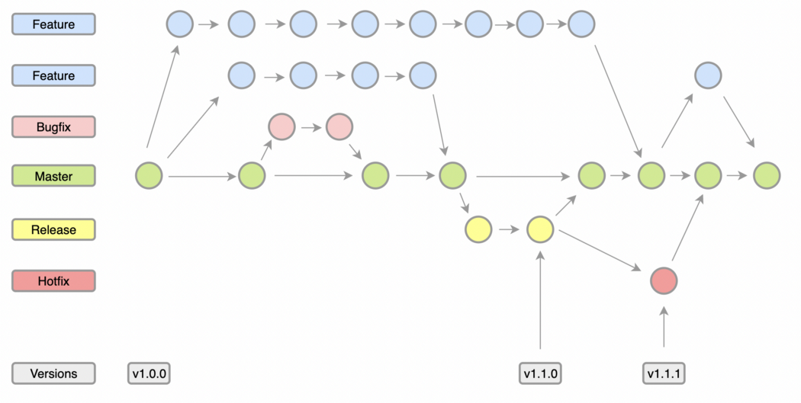
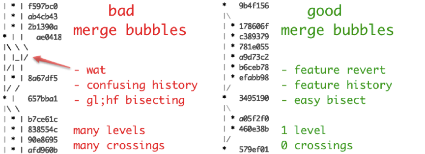
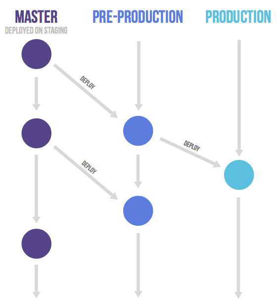
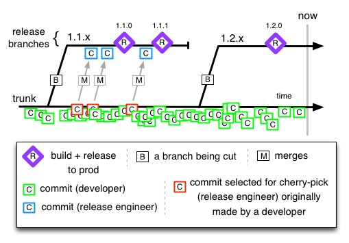

<extoc></extoc>

# 版本控制分支策略

## Git Flow

Feature branch模型。各个feature之间的代码是隔离的，可以独立地开发、构建、测试。存在两个长期分支：主分支master和开发分支develop。

前者用于存放对外发布的版本，任何时候在这个分支拿到的，都是稳定的分布版；
后者用于日常开发，存放最新的开发版。

### 优

- 适应场景多（没有创建分支解决不了的事情）
- 不影响开发进度
- 分支使用相对有条理
- 确保线上的版本稳定
### 劣
- 分支过多，不宜管理，如何创建，何时删除分支？
- 如果特性分支过多的话很容易造成代码冲突，从而提高了合入的成本（feature branch要尽量小，时间跨度不易过长）
- 并发开发的分支会相互“堵“
- git-flow使用git merge --no-ff来合并分支，在多分支的环境下会让History tree变的非常混乱
- 同时维护Master和Developer两个分支很多时候是没必要的
- master和release对于是重复的
## GitHub Flow

Fork方式。只有一个长期分支，就是master，因此用起来非常简单。Github flow 的最大优点就是简单，对于”持续发布”的产品，可以说是最合适的流程。

- 第一步：根据需求，从master拉出新分支，不区分功能分支或补丁分支。
- 第二步：新分支开发完成后，或者需要讨论的时候，就向master发起一个pull request（简称PR）。
- 第三步：Pull Request既是一个通知，让别人注意到你的请求，又是一种对话机制，大家一起评审和讨论你的代码。对话过程中，你还可以不断提交代码。
- 第四步：你的Pull Request被接受，合并进master，重新部署后，原来你拉出来的那个分支就被删除。（先部署再合并也可。）
适用场景：
- 项目必须是类似于github这种web的项目，或者库、框架、工具并非最终应用的产品，可以进行频繁的产品部署。并且能够迅速的修复发现的问题
### 优
- 只有一个master分支，简单
### 劣
- 使用前提，CI能够在Pull Request阶段覆盖大部分的测试案例。
- 对于贡献者的素质要求很高
## GitLab Flow

Gitlab flow 的最大原则叫做”上游优先”（upsteam first），即只存在一个主分支master，它是所有其他分支的”上游”。只有上游分支采纳的代码变化，才能应用到其他分支。
gitlab flow就是git flow和github flow的一个折中方案，既没有git flow那么麻烦，也没有github flow那么简单粗暴。
对于”持续发布”的项目，它建议在master分支以外，再建立不同的环境分支。比如，”开发环境”的分支是master，”预发环境”的分支是pre-production，”生产环境”的分支是production。
适用场景：

- 需要进行预发布的项目
### 优
- 清晰可控
- 规则相对git flow来说更简单
### 劣
- 相对于github flow来说，gitlab flow 更复杂
- 当维护较多版本时，会变得像git flow似的比较复杂
## Trunk Based Development

主干开发原则：

- 将任务划分成许多可以在1天以内完成的小模块，以至少每天一次的频率将分支合并到主干
- 针对研发的功能编写自动化测试用例，并在本地验证
  降低了破坏trunk的风险，trunk分支不稳定将会阻碍在这个分支上工作的所有人
- 执行实时Code Review，代码审核流程不能繁琐
- 每次向trunk提交代码时，都应该自动地触发编译和测试
适用场景：
- 对迭代速度要求高，希望需求快速交付上线
- 基础架构强，持续集成工具高效
- 团队成员习惯 TDD（测试驱动开发），代码自动化测试覆盖率高（至少增量代码的自动化测试覆盖率高）
### 优
- 分支模型简单高效，开发人员易于掌握不容易出现错误操作
- 避免了分支合并、冲突解决的困扰
- 随时拥有可发布的版本
- 有利于持续集成和持续交付
### 劣
- 基础架构要求高：合入到主干的代码若质量不过关将直接阻塞整个团队的开发工作，因此需要高效的持续集成平台进行把关
- 自动化测试要求高：需有完备单元测试代码，确保在代码合入主干前能在获得快速和可靠的质量反馈
- 最好有代码评审：若代码质量要求高，需要配套代码评审（CR）机制，在代码提交到主干时，触发 CR，通过 Peer Review 后才能正式合入
- 最好有特性开关：主干开发频发合入主干的情况下，特性拆分得很小，可能是半成品特性，需要配套特性开关（Feature Toggle），只有当特性整体开发完才通过灰度发布等手段逐步打开

## Reference
[gitflow有哪些优缺点](https://icode.best/i/35800039709780)
[github-flow](https://docs.github.com/en/get-started/quickstart/github-flow)
[gitlab-flow](https://github.com/jadsonjs/gitlab-flow)